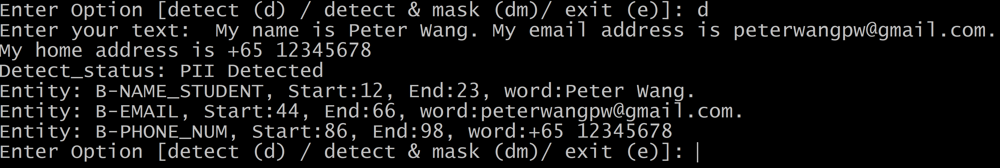
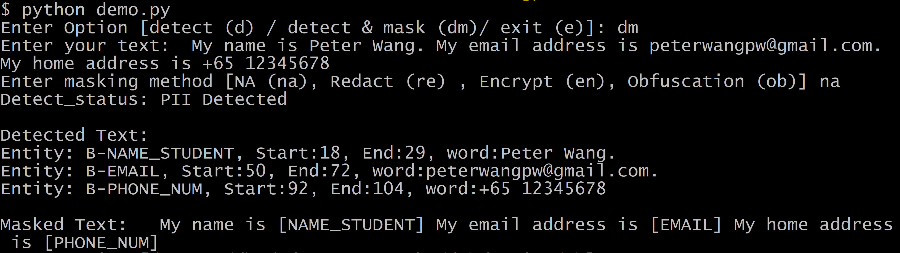

# BT5153_GP - PII Detection and Anonymization 

BT5153 group project

PI SHUHENG (A0262795N)
HUANG JIFEI (A0177326Y)
XIE XIANGXIANG (A0172369W)
WANG ZIHAO (A0262730L)

## Getting Started

### How to use our PII Protection Framework?

1. Clone the repository:
   ```
   git clone https://github.com/seanpsh/bt5153_gp.git
   ```

2. Build Environment:
   ```
   cd bt5153_gp
   conda create -n PIIProtect python=3.11
   conda activate PIIProtect 
   ```

3. Install the required dependencies:
   ```
   pip install -r requirements.txt
   ```

4. Deploy the PII detection model:

   Download the PII detection model file from google drive: https://drive.google.com/file/d/1yydwbvKwlwvDlr61h8UnPlaf2IGXJ86v/view?usp=sharing
   Place the model files in folder ./roberta_best/


5. Run the PII Protection Framework:
   ```
   python demo.py
   ```

6.1. PII detection: Key in d to activate PII detection module and then Enter the text you want to check

<div align="center">
   <figure>
      
   </figure>
</div>

6.2. PII detection & anonymization: Key in dm to activate both PII detection and PII anonymization module. Enter the text you want to check and mask.

Note: We provide 4 anonymization functions: 
- NA(na): Mask PII entities as their related PII tags.
- Redact(re): Mask all PII entities as [REDACTED]
- Encrypt(en): A reversible masking function, that encrypted PII entities as hash value. the decryption table is also generated for reversing PII entites from hash value to original text.
- Obfuscation(ob): Use place holder 'x' to mask PII entities, i.e., person@gmail.com --> pxxxxx@gmail.com

<div align="center">
   <figure>
      
   </figure>
</div>


## Model Selection and Finetune:
ipynb notebook in ./model_selection_and_finetune/full_finetuned_code.ipynb
